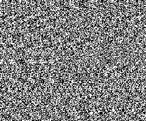
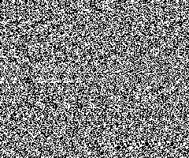
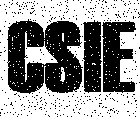

# An RG-Based 2-Secret Sharing Scheme with Abilities of OR and XOR Decryption

[cite_start]本專案實作了一種基於**隨機網格 (Random Grids, RG)** 的雙秘密分享 (Visual Secret Sharing) 系統 [cite: 3, 5][cite_start]。透過改進現有研究，以**水平橫移 (Horizontal Shift)** 取代旋轉操作，解決了秘密影像必須為正方形的限制 [cite: 7]。

## 1. 研究背景與動機
* [cite_start]**視覺密碼原理**：將秘密圖像拆解為多個看起來像隨機雜訊的份額 (Shares)，當 Shares 疊加時即可直觀重建秘密 [cite: 5]。
* [cite_start]**雙秘密還原**：本專案可在同一組 Shares 中隱藏兩張不同的秘密影像 ($SA, SB$) [cite: 9, 20]。
* [cite_start]**兼容 XOR 解密**：除了傳統模擬投影片堆疊的 **OR 運算**，本專案亦支援 **XOR 運算**，能有效避免影像疊加導致的亮度變暗問題 [cite: 8, 9]。

## 2. 演算法邏輯 (Algorithm)
[cite_start]本專案提供 **KK1, KK2, KK3** 三種加密條件 [cite: 9][cite_start]，其核心流程如下 [cite: 11, 12, 13, 14]：
1. [cite_start]**像素選取**：從第一張秘密 $SA$ 中選取像素 [cite: 11]。
2. [cite_start]**加密產出**：透過指定演算法產生網格 $G1, G2$ [cite: 12]。
3. **遞迴與位移**：
   - [cite_start]利用 $SB$ (第二秘密) 與 $G1$ 產出 $G2$，並進行 $1/p$ 的水平橫移 [cite: 13]。
   - [cite_start]利用 $SA$ 與 $G2$ 產出 $G1$，同樣位移 $1/p$ [cite: 14]。
   - [cite_start]重複上述步驟直到填滿影像 [cite: 15]。

## 3. 實驗結果展示 (Experimental Results)

### 3.1 原始影像與加密份額
| 第一秘密 (SA) | 第二秘密 (SB) | Share 1 (G1) | Share 2 (G2) |
| :---: | :---: | :---: | :---: |
|  |  |  |  |

### 3.2 還原影像對比 (Reconstruction)
| 模式 | 還原 SA (NCNU) | 還原 SB (CSIE - 橫移 $1/p$) |
| :---: | :---: | :---: |
| **OR 還原** |  |  |
| **XOR 還原** |  |  |

## [cite_start]4. 數據量化分析 (Data Analysis) [cite: 2]
[cite_start]程式會自動計算對比度，白色定義為 1 (光透度最高)，黑色為 0 [cite: 17, 18][cite_start]。詳細數據記錄於產出的 `output.txt` [cite: 2]：
* **All-Accuracy**: 整體像素一致率。
* **Black-hit**: 黑點還原精確度。
* **White-hit**: 白點還原精確度。

## 5. 使用說明
1. **環境需求**：Visual Studio 2022 與 OpenCV 4.x。
2. **圖片存放**：
   - 第一秘密放置於 `./pic/`。
   - 第二秘密放置於 `./pic2/`。
3. [cite_start]**執行流程**：啟動程式後依照選單輸入演算法編號 (1-4) 以及位移參數 `num` (建議設為 4) [cite: 13, 20]。

## 6. 參考文獻
* CHANG, Joy Jo-Yi, et al. "Two-image encryption by random grids." [cite_start]2010 IEEE [cite: 22, 23]。
